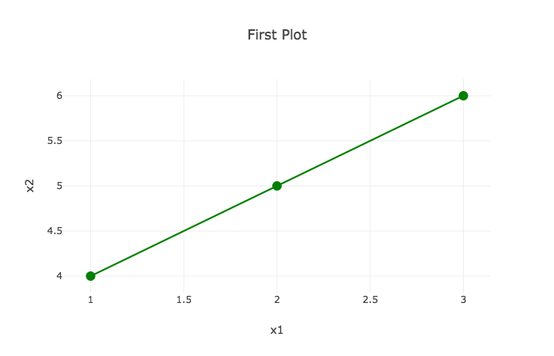
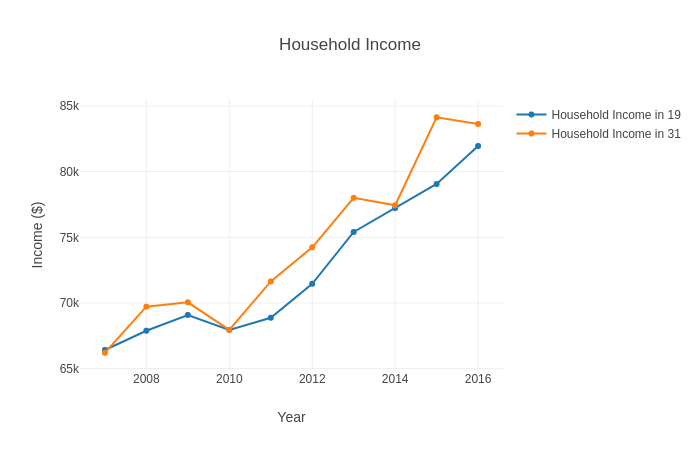
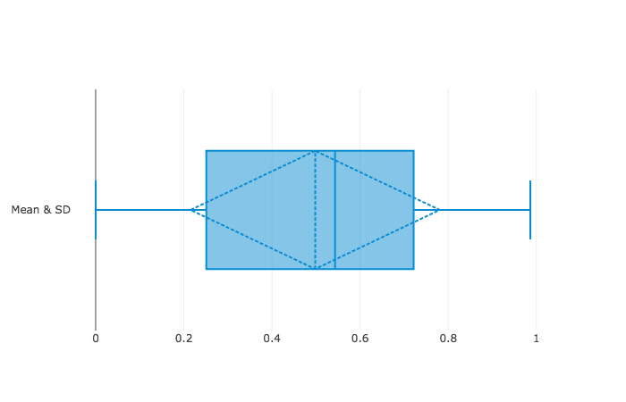
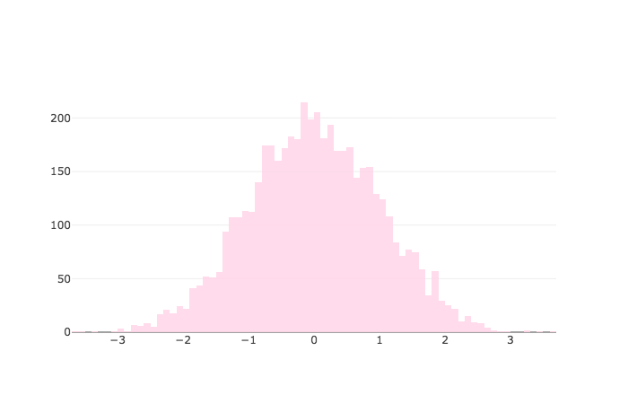
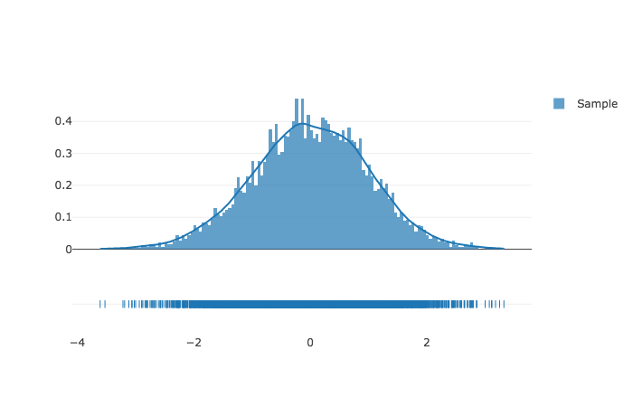
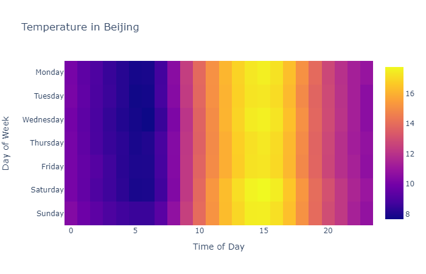
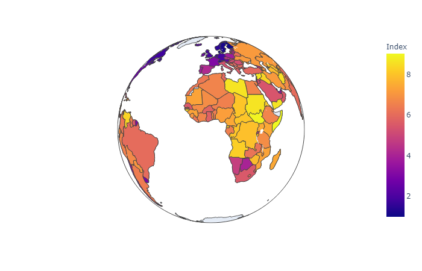
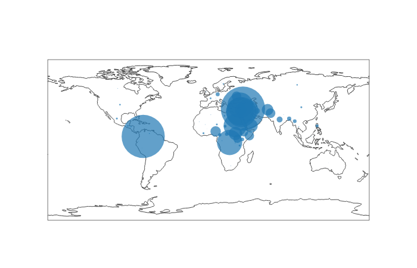
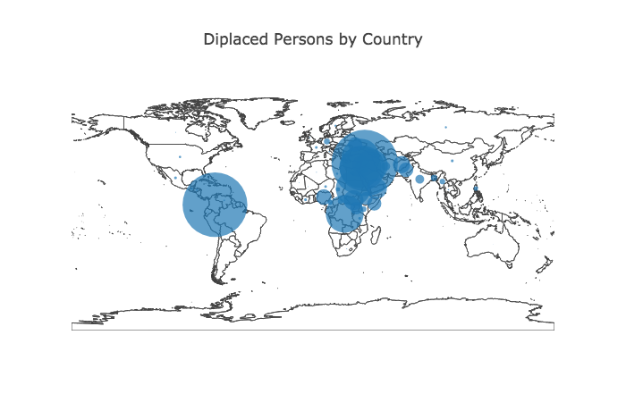

<!--
$theme: gaia
template: invert
-->

# Week 8 - Plotting with the Plotly API

---

### Plotting Options in Python

1. `matplotlib` - The classic library, with options to change just about everything. Creates static images
2. `seaborn` - A stats-focused wrapper for `matplotlib` 
3. `pygal` - For SVG-based graphics, interactive plots
4. `plotly` - Based on D3.js, allows for dynamic plotting and data dashboards hosted online
5. `bokeh` - Also based on D3.js functions
6. `plotnine/ggplot` - uses the Grammar of Graphics structure to mimic R's ggplot2

---

### Why Use Plotly?

Plotly is a good choice for several reasons:

- It allows for easy interactive plotting
- Interactive plots can be embedded in notebooks
- Can be run on a server
- Plotly has developed a dashboard API to complement their plotting library (similar to Shiny for R)
- It also has a shorthand library [`plotly_express`](https://plotly.express) for rapid exploration


---


### Getting Started

```python
from plotly.offline import plot
import plotly.graph_objs as go
```

First, we want to import `plot`, which is needed to generate plots offline. We don't want to use the Plotly servers at the moment.

Next, we import the graphing objects, which include things like Scatter plots and Histograms, and allow us to construct our visualization.


---


### Creating Plot Objects

```python
trace = go.Scatter( # initialize scatter object
  x = list(range(2000,2010)), # pass x, y values
  y = [29.8,30.1,30.5,30.6,31.3,31.7,32.6,33.1,32.7,32.8])

plotdata=go.Data([trace]) # Process the plots

plot(plotdata) # Render the plots
```

<br>

In this (very) simple example, we plot some time series data. Our plot is provided as an html page opened in the default browser.

---


### Creating Plot Objects

Let's add some formatting. First, we can change the marker size and the color of our plot:

```python
trace = go.Scatter( # initialize scatter object
  x = list(range(2000,2010)), # pass x, y values
  y = [29.8,30.1,30.5,30.6,31.3,31.7,32.6,33.1,32.7,32.8],
  marker =  {'color': 'green', # choose the marker color
    'symbol': 0, # choose a shape
    'size': 20}, # choose a size
    ) 

plotdata=go.Data([trace]) # Process the plots

plot(plotdata) # Render the plots
```

A new plot should open in the browser.

---

### Creating Plot Objects

Next, we can smooth our line between markers:

```python
trace = go.Scatter( # initialize scatter object
  x = list(range(2000,2010)), # pass x, y values
  y = [29.8,30.1,30.5,30.6,31.3,31.7,32.6,33.1,32.7,32.8],
  marker =  {'color': 'green', # choose the marker color
    'symbol': 0, # choose a shape
    'size': 20}, # choose a size
    line=dict(
        shape='spline' # spline smoothing
    )) 

plotdata=go.Data([trace]) # Process the plots

plot(plotdata) # Render the plots
```

---


### Creating Plot Objects

We can add text to our markers:

```python
trace = go.Scatter( # initialize scatter object
  x = list(range(2000,2010)), # pass x, y values
  y = [29.8,30.1,30.5,30.6,31.3,31.7,32.6,33.1,32.7,32.8],
  marker =  {'color': 'green', # choose the marker color
    'symbol': 0, # choose a shape
    'size': 20}, # choose a size
    line=dict(
        shape='spline' # spline smoothing
    ),
    text=['Year: ' + str(i) for i in list(range(2000,2010))], # hover text
    name='PCC') # name for legends

plotdata=go.Data([trace]) # Process the plots

plot(plotdata) # Render the plots
```

---

### Creating Plot Objects

We can add information to our plot by adding `Layout` and `Figure` objects:

```python
plotdata=go.Data([trace]) # Process the plots

layout=go.Layout(title="Per Capita Cheese Consumption", 
                 # configure the plot
  xaxis={'title':'Year'},  # layout and name
  yaxis={'title':'Pounds of Cheese'})  # the axes.

figure=go.Figure(data=plotdata,layout=layout)
# combine data and layout code

plot(figure) # Render the plots
```


---

### Creating Plot Objects

Let's add a second series:

```python
trace2 = go.Scatter( # initialize scatter object
  x = list(range(2000,2010)), # pass x, y values
  y = [327,456,509,497,596,573,661,741,809,717],
  marker =  {'color': 'grey', # choose the marker color
    'symbol': 0, # choose a shape
    'size': 20}, # choose a size
    line=dict(
        shape='spline' # spline smoothing
    ),
    text=['Year: ' + str(i) for i in list(range(2000,2010))], # hover text
    name='DIB',
    yaxis='y2') # name for legends
```

---

### Creating Plot Objects

We also need to update our data and layout objects:

```python
plotdata=go.Data([trace, trace2]) # Process the plots

layout=go.Layout(title="Per Capita Cheese Consumption", 
                 # configure the plot
  xaxis={'title':'Year',
         'showgrid':False}, # hide the gridlines  
  yaxis={'title':'Pounds of Cheese',
         'showgrid':False},

figure=go.Figure(data=plotdata,layout=layout)
# combine data and layout code

plot(figure) # Render the plots
```

---

### Creating Plot Objects

AND we should add a secondary y axis:

```python
plotdata=go.Data([trace, trace2]) # Process the plots

layout=go.Layout(title="Cheese Consumption and Bedsheet Tragedies", 
                 # configure the plot
  xaxis={'title':'Year',
         'showgrid':False},  # layout and name
  yaxis={'title':'Pounds of Cheese',
         'showgrid':False},
  yaxis2={'title':"Deaths due to Becoming Tangled in Bedsheets",
          'overlaying': 'y',
          'side':'right',
          'showgrid':False})  # the axes.
```

---

### Creating Plot Objects

Our plot now looks something like this:

<center>



</center>

---

### Using Existing Data


Let's import average household income data for Nebraska using the ACS data at dadata.cba.edu:

```python
from sqlalchemy import create_engine
import pandas as pd

SELECT = """SELECT AVG(hhincome) AS hhincome, year 
  FROM ACS
  WHERE statefip=31 
  GROUP BY year
  ORDER BY year"""
conn = create_engine(
  'mysql+mysqlconnector://viewer:@dadata.cba.edu:3306/ACS'
  )

data = pd.read_sql(SELECT, conn)
```

---


### Using Existing Data

```python
trace = go.Scatter( # initialize scatter object
  x = data['year'], 
  y = data['hhincome'], 
  marker =  {'color': 'green', 
    'symbol': 0, 
    'size': 12},
  mode="markers+lines", 
  name='Household Income Over Time') 

plotdata=go.Data([trace]) 
layout=go.Layout(title="Household Income",
  xaxis={'title':'Year'},  
  yaxis={'title':'Income ($)'})  

figure=go.Figure(data=plotdata,layout=layout)
plot(figure)
```


---


### Let's Use More States!

First, update our dataset:

```python
SELECT = """SELECT AVG(hhincome) AS hhincome, year,
    statefip
  FROM ACS
  WHERE statefip=31 or statefip=19
  GROUP BY year, statefip
  ORDER BY year, statefip"""
conn = create_engine(
  'mysql+mysqlconnector://viewer:@dadata.cba.edu:3306/ACS'
  )

data = pd.read_sql(SELECT, conn)
```

---

### Let's Use More States!

```python
traces = []
for i in data['statefip'].unique():
  small_data = data.loc[data['statefip']==i, :]
  traces.append(go.Scatter( # initialize scatter object
    x = small_data['year'], 
    y = small_data['hhincome'], 
    mode="markers+lines", 
    name='Household Income in {}'.format(i)))

plotdata=go.Data(traces) 
layout=go.Layout(title="Household Income",
  xaxis={'title':'Year'},  
  yaxis={'title':'Income ($)'})  

figure=go.Figure(data=plotdata,layout=layout)
plot(figure)
```

---

### Let's Use More States!

<center>



</center>

---

### Other Plot Types

We can do a LOT more than scatter plots!

- [Box Plots](https://plot.ly/python/box-plots/)
- [Histograms](https://plot.ly/python/histograms/), [with distribution stats](https://plot.ly/python/distplot/)
- [Heatmaps](https://plot.ly/python/heatmaps/)
- [Choropleth](https://plot.ly/python/choropleth-maps/), [Line](https://plot.ly/python/lines-on-maps/), and [Bubble Maps](https://plot.ly/python/bubble-maps/)

among many others.


---


### Box Plots

<br>

```python
trace1 = go.Box(
  y=np.random.rand(100),
  name='Mean & SD',
  marker=dict(
    color='rgb(10, 140, 208)',
  ),
  boxmean='sd' # Shows quartiles AND Std Dev on plot
)

plotdata = go.Data([trace1])
figure = go.Figure(data=plotdata)
plot(figure)
```

---

### Box Plots

<br>
<center>



</center>


---


### Histograms

```python
trace1 = go.Histogram(
  x=np.random.randn(5000),
  histnorm='density',
  xbins=dict( # Declare bin size
    start=-4.0,
    end=4.0,
    size=0.1
  ),
  marker=dict( # Customize markers
    color='#FFD7E9',
  ),
  opacity=0.9
)

plotdata = go.Data([trace1])
figure = go.Figure(data=plotdata)
plot(figure)
```


---

### Histograms

<br>
<center>



</center>


---


### Histograms and Distributions


```python
import plotly.figure_factory as ff

x = np.random.randn(5000)  
hist_data = [x]
group_labels = ['Sample'] # Labels our 'rug' plot

fig = ff.create_distplot(hist_data, 
  group_labels, 
  bin_size=0.05,
  show_hist=True,  # Toggle histogram
  show_curve=True, # Toggle smoothed distribution
  show_rug=True    # Toggle rug plot
  )
  
plot(fig)
```

---

### Histograms and Distributions

<br>
<center>



</center>


---

### Heatmaps

<br>

```python
# Create an array of data (its from MNIST)
x = [0,0,0,0,0,0,0,0,0,0,0,0,0,0,0,0,0,0,0,0,0,0,0,0,0,0,0,0,0,0,0,0,0,0,0,0,0,0,0,0,0,0,0,0,0,0,0,0,0,0,0,0,0,0,0,0,0,0,0,0,0,0,0,0,0,0,0,0,0,0,0,0,0,0,0,0,0,0,0,0,0,0,0,0,0,0,0,0,0,0,0,0,0,0,116,125,171,255,255,150,93,0,0,0,0,0,0,0,0,0,0,0,0,0,0,0,0,0,0,0,0,169,253,253,253,253,253,253,218,30,0,0,0,0,0,0,0,0,0,0,0,0,0,0,0,0,0,0,169,253,253,253,213,142,176,253,253,122,0,0,0,0,0,0,0,0,0,0,0,0,0,0,0,0,0,52,250,253,210,32,12,0,6,206,253,140,0,0,0,0,0,0,0,0,0,0,0,0,0,0,0,0,0,77,251,210,25,0,0,0,122,248,253,65,0,0,0,0,0,0,0,0,0,0,0,0,0,0,0,0,0,0,31,18,0,0,0,0,209,253,253,65,0,0,0,0,0,0,0,0,0,0,0,0,0,0,0,0,0,0,0,0,0,0,0,117,247,253,198,10,0,0,0,0,0,0,0,0,0,0,0,0,0,0,0,0,0,0,0,0,0,0,76,247,253,231,63,0,0,0,0,0,0,0,0,0,0,0,0,0,0,0,0,0,0,0,0,0,0,0,128,253,253,144,0,0,0,0,0,0,0,0,0,0,0,0,0,0,0,0,0,0,0,0,0,0,0,176,246,253,159,12,0,0,0,0,0,0,0,0,0,0,0,0,0,0,0,0,0,0,0,0,0,0,25,234,253,233,35,0,0,0,0,0,0,0,0,0,0,0,0,0,0,0,0,0,0,0,0,0,0,0,198,253,253,141,0,0,0,0,0,0,0,0,0,0,0,0,0,0,0,0,0,0,0,0,0,0,0,78,248,253,189,12,0,0,0,0,0,0,0,0,0,0,0,0,0,0,0,0,0,0,0,0,0,0,19,200,253,253,141,0,0,0,0,0,0,0,0,0,0,0,0,0,0,0,0,0,0,0,0,0,0,0,134,253,253,173,12,0,0,0,0,0,0,0,0,0,0,0,0,0,0,0,0,0,0,0,0,0,0,0,248,253,253,25,0,0,0,0,0,0,0,0,0,0,0,0,0,0,0,0,0,0,0,0,0,0,0,0,248,253,253,43,20,20,20,20,5,0,5,20,20,37,150,150,150,147,10,0,0,0,0,0,0,0,0,0,248,253,253,253,253,253,253,253,168,143,166,253,253,253,253,253,253,253,123,0,0,0,0,0,0,0,0,0,174,253,253,253,253,253,253,253,253,253,253,253,249,247,247,169,117,117,57,0,0,0,0,0,0,0,0,0,0,118,123,123,123,166,253,253,253,155,123,123,41,0,0,0,0,0,0,0,0,0,0,0,0,0,0,0,0,0,0,0,0,0,0,0,0,0,0,0,0,0,0,0,0,0,0,0,0,0,0,0,0,0,0,0,0,0,0,0,0,0,0,0,0,0,0,0,0,0,0,0,0,0,0,0,0,0,0,0,0,0,0,0,0,0,0,0,0,0,0,0,0,0,0,0,0,0,0,0,0,0,0,0,0,0,0,0,0,0,0,0,0,0,0,0,0,0,0,0,0,0,0,0,0,0,0,0,0,0,0,0,0,0,0,0,0,0,0,0,0,0,0,0,0,0,0,0,0,0,0,0,0,0,0,0,0,0,0,0]
x = - np.array(x).reshape(28,28)


trace = go.Heatmap(z = x, colorscale = "Greys")
plotdata=[trace]
plot(plotdata)
```

---

### Heatmaps

<br>
<center>



</center>


---

### Choropleth Maps

```python
data = pd.read_csv("corruption2018.csv")

plotdata = go.Choropleth(
        locations = data['Abbr'],
        z = data['Index'],
        text = (data['Name'], data['Index']),
        autocolorscale = False,
        colorscale = 'Picnic',
        showscale = True,
    )


figure = go.Figure(data=[plotdata])
plot(figure)
```

Map data from the [INFORM Index](http://www.inform-index.org/Results/Global)

---

### Choropleth Maps

<br>
<center>


</center>

---

### Mapping Options: Layout->Geo

We have many additional options that we can pass to the layout of our plot when dealing with geographic data.

- Map projection
- Map scope
- Country lines
- Lots more

Here is a link to the [full documentation](https://plot.ly/python/reference/#layout-geo)

---

### Choropleth Maps - Layout

```python
layout = go.Layout(
    title = "Percieved Corruption",
    geo = dict(projection = dict(type='orthographic'),
               showcoastlines=False,
               showcountries = False,
               showframe = False,
               showrivers=False,
               scope = 'world'
        )
    )

figure = go.Figure(data=[plotdata], layout=layout)
plot(figure)

```

---


### Choropleth Maps

<br>
<center>



</center>


---


### Bubble Maps

```python
data = pd.read_csv("displaced2018.csv")

plotdata = go.Scattergeo(
            locationmode = 'country names',
            locations = data['Name'],
            marker = dict(
                size = data['Displaced']/100000,
                line = dict(width = 0)
            ),
            text = data['Displaced']
            )

figure = go.Figure(data=[plotdata])
plot(figure)
```

---

### Bubble Maps

<br>
<center>



</center>

---


### Bubble Maps

```python
...
layout = go.Layout(
    title = "Percieved Corruption",
    geo = dict(projection = dict(type='orthographic'),
               showcountries = True,
        )
    )

figure = go.Figure(data=[pdata], layout=layout)
plot(figure)
```

---


### Bubble Maps

<br>
<center>



</center>


---

### For Lab Tonight

Let's make use of this week's and last week's data together! 
- Draw data from any dataset
- Generate three plots that you find interesting
- Try to use at least two different kinds of plots, just to get more practice