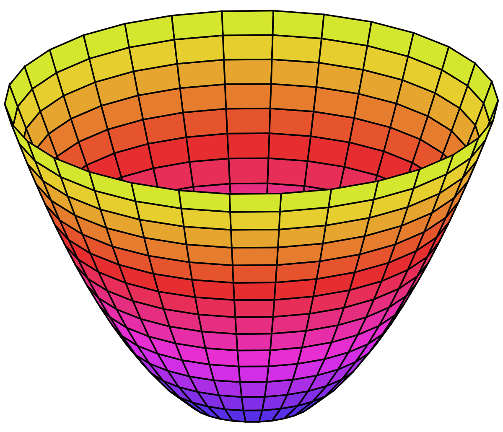

# SciPy and Optimization

---

# Optimization in Math/Economics

Many critical problems in analysis are framed as optimization problems.

- Classification Models
- Regression Models
- Utility Maximization
- Oligopoly Best Response Functions
- Dynamic Programming

---

# Optimization

Framing a problem as a case of optimization provides an intuitive way to solve it, and (typically) clear indications of when a solution has been reached

- What mathematical conditions allow us to establish the existence of a minimum value?

---

# Optimization

Framing a problem as a case of optimization provides an intuitive way to solve it, and (typically) clear indications of when a solution has been reached

- What mathematical conditions allow us to establish the existence of a minimum value?
	- First derivative(s) equal to 0
	- Second derivatives positive

---

# Optimization in Economics - Utility Maximization

Consider an individual choosing consumption of two goods in order to maximize utility:

$$ U(x, y) = x^\alpha y^\beta $$

The individual also has a budget constraint:

$$ I=p_x \cdot x + p_y \cdot y $$


---

# Utility Maximization

The two equations represent a **constrained optimization** problem.
- Want to consume **all the things**, but can't afford to.
- How happy can we be, given a limited amount of money?

Stated mathematically:
$$ max_{x, y}\;\;U(x,y)\;\;\text{subject to}$$
$$ I=p_x \cdot x + p_y \cdot y $$

---

# Utility Maximization

We can rewrite these two equations as a single problem in order to find the maximum:

<br>

$$ \mathcal{L} = x^\alpha y^\beta + \lambda(I- p_x \cdot x - p_y \cdot y)  $$

This is the **Lagrangian** expression of our optimization problem.

<!-- Let's walk through the solution. -->

---

# Geometrically




In a computational optimization problem, we need to find a way to get ourselves to the optimum (minimum in this case), and to know when we get there.

---

# Geometrically


Typically, we use some form of **gradient descent** to find our way to the minimum value of a function.

---

# What is a gradient?

A function, $f$, with two variables $x$ and $y$ has two partial derivatives:

<br>

$$ f(x, y) \rightarrow \frac{\partial f}{\partial x} \text{ and } \frac{\partial f}{\partial y} $$

<br>

Each partial derivative tells us how $f$ changes as we move in a particular dimension **while remaining stationary in the other**.

---

# What is a gradient?

The **gradient**, then, is the vector of all partial derivatives of a given function at any point along the function:

$$ \nabla f = \left[ \begin{matrix} \frac{\partial f}{\partial x} \\ \\ \frac{\partial f}{\partial y} \end{matrix} \right]  $$

We can use the gradient to determine the linear approximation of a function's shape at any given point.

Think about it as the slope and direction of a hill you are hiking on.

---

# Gradient Descent


**Gradient Descent** is a technique in which we algorithmically move toward what we believe to be the minimum value of our function based on the current slope of our function.


---

# Gradient Descent

#### Steps of a gradient descent algorithm:
- Evaluate the gradient of the function
- Find the direction of steepest descent
- Determine how far to move in that direction
- Move to new point
- Reevaluate the gradient
- Stop moving when gradient is within a margin of error from 0


---

# Exercise

Estimate the gradient of the following function (using Python!):

$$ y = \text{sin}(x) - (z+3)^2 $$

where
1) $x = 1$ and $z=10$
2) $x=-3$ and $z=2$

Hint: try changing $x$ and $z$ by small amounts, and evaluating the difference

---

# Exercise Answer

```python
import numpy as np

# Define function y in terms of x and z
def y(x, z):
  return np.sin(x) - (z+3)**2
  
# Approximate gradient in x and z at point 1
(y(1,10) - y(1.1,10))/.1 # x direction, value ~0.497
(y(1,10) - y(1,10.1))/.1 # z direction, value ~26.1

# Approximate gradient in x and z at point 2
(y(-3,2) - y(-2.9,2))/.1 # x direction, value ~0.981
(y(-3,2) - y(-3,2.1))/.1 # z direction, value ~10.1
```

---

# Gradients and Optimization in Scipy

When we need to optimize a function, we can easily do so using Scipy's built-in `optimize` module.

```python
import numpy as np
from scipy.optimize import minimize
```

There is NO maximize function.

Why?

---

# Gradients and Optimization in Scipy

When we need to optimize a function, we can easily do so using Scipy's built-in `optimize` module.

```python
import numpy as np
from scipy.optimize import minimize
```

There is NO maximize function.

Why? Because any maximization problem can be restated as a minimization problem! (Multiply by $-1$)

---

# Optimizing our exercise function

```python
def y(x, z):
  return np.sin(x) - (z+3)**2
```

There are two problems with our function that we need to resolve:

1) We need to be able to pass an array of values to our function when using `minimize`, and here we pass two numbers
2) Our problem is concave, and so has a maximum
	- We need to restate it as a minimization problem

---

# Optimizing our exercise function

```python
def y(x, z):
  return np.sin(x) - (z+3)**2

def q(x):
  return -1*y(x[0], x[1])
```

We can wrap our function `y` in a new function `q` taking only an array of numbers, and have it return the negative of our original equation.

Now we are ready to minimize!

---

# Optimizing our exercise function

```python
>>> res = minimize(q, [0,0]) # provide function and
>>> res                      # starting guess to minimize
      fun: -0.9999999999999999
 hess_inv: array([[  1.00056201e+00,   4.96640470e-04],
       [  4.96640470e-04,   5.00458796e-01]])
      jac: array([  0.00000000e+00,  -7.45058060e-09])
  message: 'Optimization terminated successfully.'
     nfev: 28
      nit: 6
     njev: 7
   status: 0
  success: True
        x: array([ 1.57079632, -3.00000001])
```

What happens if you try a different starting point?

<!---

### For Lab Today

Using a functional representation of the Lagrangian and the `minimize` function from `scipy.optimize`, solve the following specific utility maximization problem:

$$ U(x,y) = x^{0.3} y^{0.7}$$
Income is $500, and the price of x is $3, while the price of y is $20.

See the Lagrangian slide for help setting up the problem.

-->

---

# For Lab/Homework

You will add a Logistic Regression method to your `RegressionModel` class. You will need to do the following in order to implement Logistic Regression:
- Create a function to calculate the log-likelihood function (see [these slides](https://github.com/dustywhite7/Econ8320/blob/master/SlidesPDF/10-2%20-%20Logit%20Primer.pdf) for a guide)
- Use gradient descent
- Calculate the model standard error (see Logit primer slides above)
- Calculate coefficient standard errors, z-statistics, and p-values