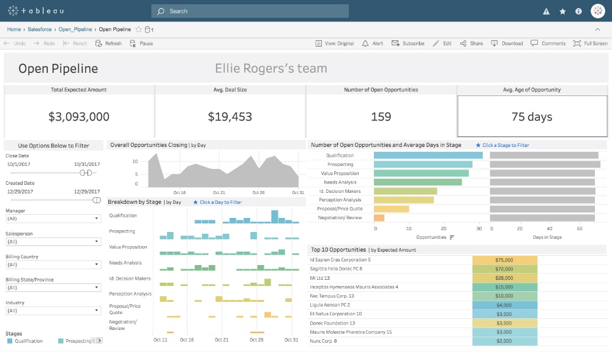
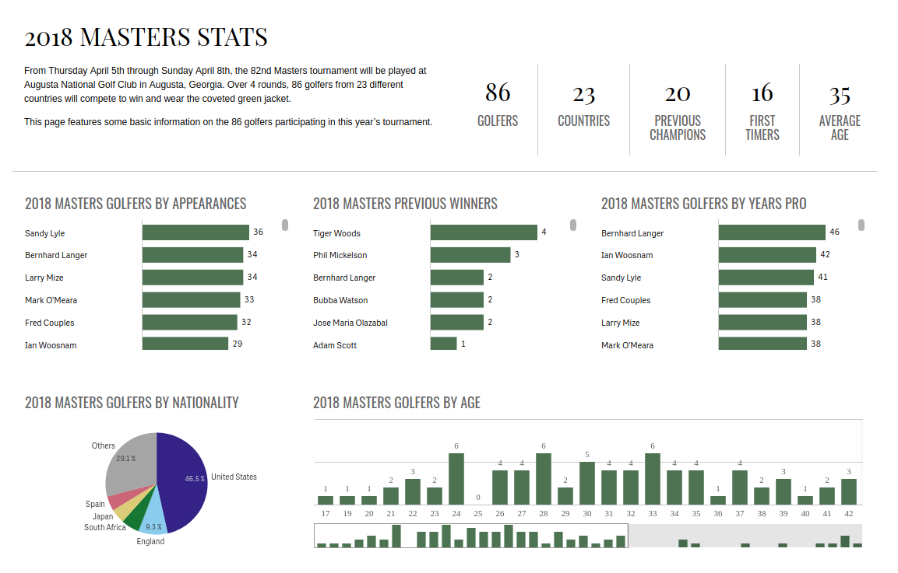
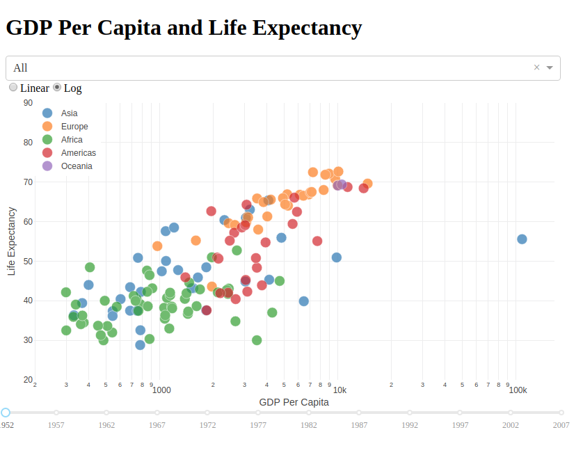
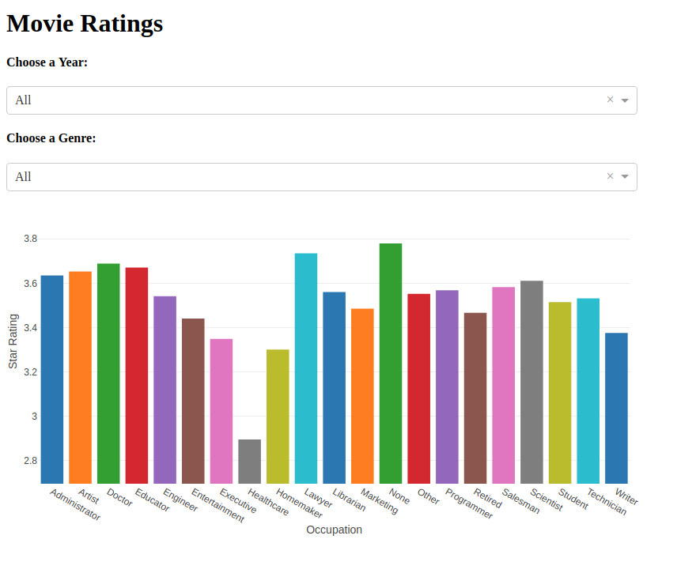

### Dashboards with [Plotly](https://plot.ly/python/)/[Dash](https://plot.ly/products/dash/)


---

### What Are Dashboards?

<br>

- Information repositories
- Make information available to non-specialists
- Provide easy access to diverse information
- Allow the end-user to explore data
- Alternative to static reporting


---

### Dashboard Options - Tableau

<br>




---

### Dashboard Options - PowerBI

<br>


---

### Dashboard Options - Qlik

<br>




---

### Dashboard Options - BYOD

We might also choose to design our own dashboard, based on needs that are unique to our business problem or data.

In Python, we can do this with [Dash](https://plot.ly/products/dash/), made by the Plotly team. (In R, this can be done with [Shiny](https://shiny.rstudio.com/))

<br>

This may not be the quickest way to make dashboards, but it is absolutely the most flexible.


---

### Dash - Introduction

Let's walk through some example code provided by Dash to get started.

First, we need our import statements

```python
import dash
import dash_core_components as dcc # The dashboard items
import dash_html_components as html # The backbone
import pandas as pd
import plotly.graph_objs as go # Our plotting tool
```

Because Dash will construct our website for us, we have a lot of imports to make.


---

### Dash - Introduction

```python
app = dash.Dash()

df = pd.read_csv(
  'https://gist.githubusercontent.com/chriddyp/' +
  '5d1ea79569ed194d432e56108a04d188/raw/' +
  'a9f9e8076b837d541398e999dcbac2b2826a81f8/'+
  'gdp-life-exp-2007.csv')
```

Here, we create an instance of the `Dash` class (that will hold our dashboard), and import a csv reflecting life expectancy by country.

---

### Dash - Introduction

```python
dashData = [
  go.Scatter(
    x=df[df['continent'] == i]['gdp per capita'],
    y=df[df['continent'] == i]['life expectancy'],
    text=df[df['continent'] == i]['country'],
    mode='markers',
    opacity=0.7,
    marker={
      'size': 15,
      'line': {'width': 0.5, 'color': 'white'}
    },
    name=i
    ) for i in df.continent.unique()
  ]
```

Our data object is structured just like Plotly

---

### Dash - Introduction

```python
dashLayout = go.Layout(
  xaxis={'type': 'log', 'title': 'GDP Per Capita'},
  yaxis={'title': 'Life Expectancy'},
  margin={'l': 40, 'b': 40, 't': 10, 'r': 10},
  legend={'x': 0, 'y': 1},
  hovermode='closest'
  )
```

And Layout looks just like Plotly as well!

This is because Plotly is the underlying graphing library that we are using to generate the graphs.

---

### Dash - Introduction

```python
app.layout = html.Div([
  dcc.Graph(
    id='life-exp-vs-gdp',
    figure={
       'data': dashData,
       'layout': dashLayout
      }
  )
])

if __name__ == '__main__':
  app.run_server()
```

We need to organize our plot inside of the HTML structure. We can start with an `html.Div` object.

---

### Serve the Dashboard!

Now we are ready to serve our first dashboard. This code can be run inside a Jupyter Notebook or a script on your **local machine**. 

If you need, you can run your Dash app from the Mimir IDE, by replacing the `app.runserver()` line with

`app.run_server(host='0.0.0.0', port=80, debug=False)`

Then, under the "View" menu, choose "View Port" and select "Port 80"

---

### Using Object ID's

In the code on the last slide, we assign the `dcc.Graph` object an `id` attribute:

```python
dcc.Graph(
    id='life-exp-vs-gdp',
    ...
```

This `id` allows us to manipulate the contents of this object as we design our visual for interactivity. We will be able to refer back to this `dcc.Graph` object using its `id` whenever we want to modify or update it. (We WILL want to as we build out our dashboard!)

---

### Quick Note: `html.Div`

What is a `Div`? This HTML tag is used to organize websites, and is particularly valuable when using CSS (cascading style-sheets) to format a website.

In Dash, they will be used as containers for different kinds of objects on our dashboard. We can even replace all of their contents based on input from the user if we so choose.

---

### Dash - Adding Controls

In order to add controls to our Dashboard (so that it isn't just a single Plotly visual), we need  to include another import statement:

```python
from dash.dependencies import Input, Output
```

We can now describe to Dash the way in which we want information to interact with our visual.

---

### Dash - Adding Controls

After our import statements, we can start a new Dashboard:

```python
df = pd.read_csv(
    'https://raw.githubusercontent.com/plotly/'
    'datasets/master/gapminderDataFiveYear.csv')

app = dash.Dash()
```

This dataset will offer us more information on life expectancy, so that we can increase the amount of control that we have.

---

### Dash - Adding Controls

From here, we need to look at the [script](https://github.com/dustywhite7/Econ8320/blob/master/LabCode/dashPart2.py) as a whole, since our code will all work together to generate our interactive plot.



---

### Dash - Another Example

Let's take a look at a [different example](https://github.com/dustywhite7/Econ8320/blob/master/LabCode/dashMovies.py) using movie rating information:



---

### Dash - Adding Controls

- We can utilize as many inputs as we would like
	- BUT! We can only use one output per callback
- Our options for inputs include
	- Dropdown Menus
	- Sliders
	- Date Selection
	- Interactive Tables
	- Checkboxes and Radio Buttons

---

### Dash - Many Controls

- While we can only use one output per callback, we can create multiple callback functions to update our model and figures. For example, we could
  - Create a callback to tie a dropdown menu to Genre
  - Create radio buttons to hide or unhide a Table of the data presented in our dashboard

---

### Dash - Interactivity

We can also implement [interactivity](https://dash.plot.ly/interactive-graphing) between plot elements using the following features

1) React to user hovering over a point
2) React to user selecting points
3) React to user zooming on points
4) React to user clicking on points


---

### Homework This Week

Use your data from last week. Incorporate three or more plotly  visuals of your data into a dashboard using the `dash` library from class this week.  You need to provide the following:
- Your code
- A one page explanation of your dashboard
- The dataset that you used

Your dashboard should have at least one form of interactivity (a series of button controls, a dropdown list, or a way that interacting with one visual affects the others).

Submit through Canvas! (Assignment 11)