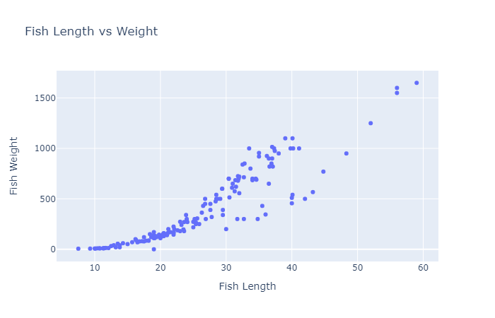
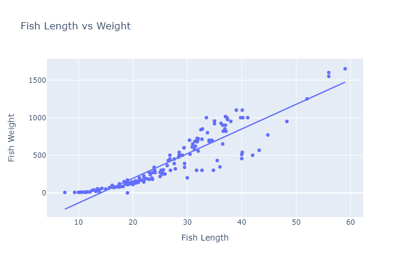
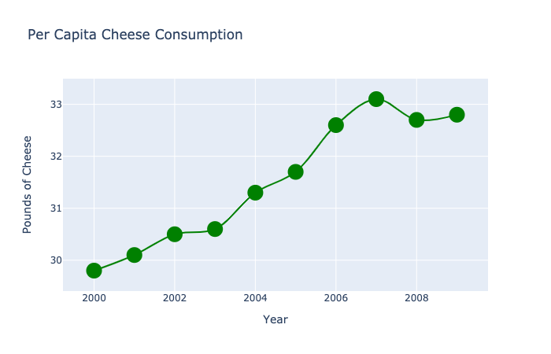
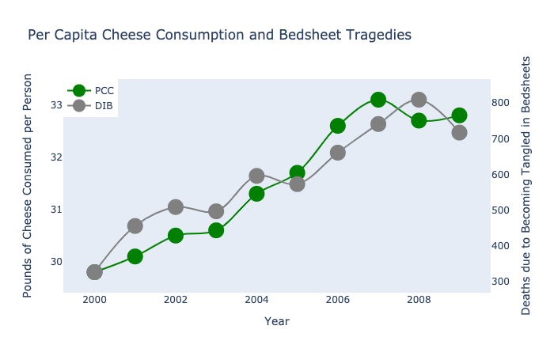
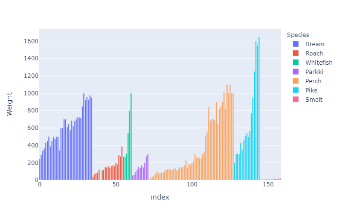
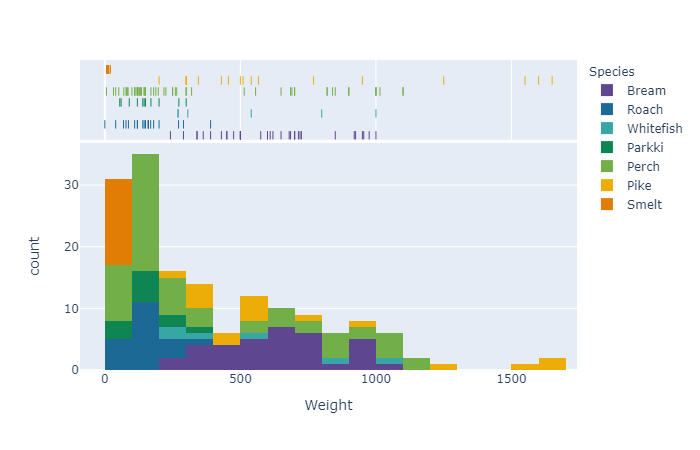
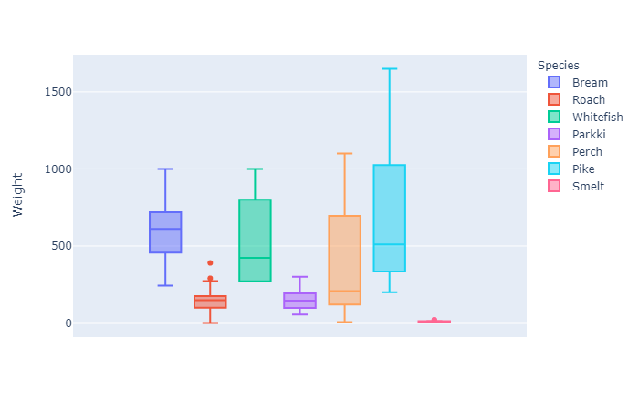
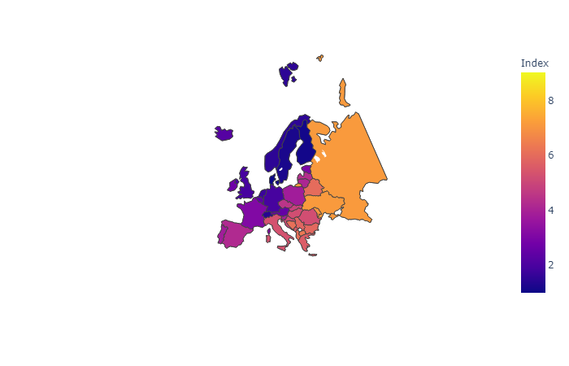

# Using Plotly to Make Figures and Charts

---

# Why Use Plotly?

Plotly is a good choice for several reasons:

- It allows for easy interactive plotting
- Interactive plots can be embedded in notebooks
- Can be run on a server
- Plotly has developed a [dashboard API](https://dash.plotly.com/introduction) to complement their plotting library (similar to Shiny for R)
- It also has a shorthand library [`plotly_express`](https://plotly.express) for rapid exploration


---


# Getting Started

```python
import plotly.express as px
```

First, we want to import `plotly.express`, which will serve as the engine for creating our figures in `plotly`.

---

# Using Existing Data


Let's import a `pandas` Data Frame to play with some :fish: data:

```python
import pandas as pd

data = pd.read_csv( # put link back on one line!
    "https://github.com/dustywhite7/pythonMikkeli/
    raw/master/exampleData/fishWeight.csv")
```


---


# Creating Plot Objects

```python
px.scatter(data, x='Length1', y='Weight')
```

<br>

In this (very) simple example, we plot some data about length and weight. Our figure is rendered in the notebook.

---


---

# Formatting

Let's add some formatting. First, we can change the axis labels and title to match :

```python
px.scatter(data, x='Length1', y='Weight',
    title = "Fish Length vs Weight", # update the title of the figure
    labels = { # dictionary for axis labels
        'Length1' : 'Fish Length', # key should match original label
        'Weight' : "Fish Weight" # value should be new label value
    })
```

---




---

# Trendlines

Next, we can add a regression trendline:

```python
px.scatter(data, x='Length1', y='Weight',
    title = "Fish Length vs Weight", # update the title of the figure
    labels = { # dictionary for axis labels
        'Length1' : 'Fish Length', # key should match original label
        'Weight' : "Fish Weight" # value should be new label value
    },
    trendline = 'ols' # add a linear trendline
)
```

We can also use `lowess` trendlines!

---




---

# Line Charts

We could instead use line charts

```python
px.line(data, x='Length1', y='Weight',
    title = "Fish Length vs Weight", # update the title of the figure
    labels = { # dictionary for axis labels
        'Length1' : 'Fish Length', # key should match original label
        'Weight' : "Fish Weight" # value should be new label value
    })
```

---



### Clearly, not helpful here... (our data is not ordinal)


---

# Creating Plot Objects

Let's show multiple series by separating our observations according to species:

```python
px.scatter(data, x='Length1', y='Weight',
    title = "Fish Length vs Weight", # update the title of the figure
    labels = { # dictionary for axis labels
        'Length1' : 'Fish Length', # key should match original label
        'Weight' : "Fish Weight" # value should be new label value
    },
    trendline = 'ols', # add a linear trendline,
    color = 'Species'
)

```

---

# Creating Plot Objects



Note that we even get a separate trend line for each color group! :smiley:

---


# Other Plot Types

We can do a LOT more than scatter plots!


- [Bar Charts](https://plotly.com/python/bar-charts/)
- [Box Plots](https://plot.ly/python/box-plots/)
- [Histograms](https://plot.ly/python/histograms/), with distribution stats, too!
- [Heatmaps](https://plot.ly/python/heatmaps/)
- [Choropleth](https://plot.ly/python/choropleth-maps/), [Line](https://plot.ly/python/lines-on-maps/), and [Bubble Maps](https://plot.ly/python/bubble-maps/)

among many others.


---


# Using Bar Charts

First, we can make a bar chart:

```python
px.bar(data, y="Weight", color="Species")
```


---




---

# Histogram

Maybe that data would do better if we could aggregate it in bins to better understand how many fish were observed in each weight bin:

```python
px.histogram(data, 
        x="Weight", 
        marginal="rug", 
        color="Species",  
        color_discrete_sequence=px.colors.qualitative.Prism)
```

---



---

# Box Plots


```python
px.box(data, y="Weight", color="Species")
```

---





---

# Heatmaps

```python
data = pd.read_csv(
    "https://raw.githubusercontent.com/dustywhite7/pythonMikkeli/master/exampleData/pollutionBeijing.csv")

data['datetime'] = pd.to_datetime(data['datetime'])
data['weekday'] = data['datetime'].dt.dayofweek
data['hour'] = data['datetime'].dt.hour
data = data.groupby(['weekday', 'hour'])['TEMP'].mean()
data = data.values.reshape((7,24))

px.imshow(data, title="Temperature in Beijing" ,
          labels=dict(y="Day of Week", x="Time of Day"), 
          y=['Monday', 'Tuesday', 'Wednesday', 'Thursday', 'Friday', 'Saturday', 'Sunday'])
```

---


---

# Choropleth Maps

```python
data = pd.read_csv(
  "https://raw.githubusercontent.com/dustywhite7/Econ8320/master/LabCode/corruption2018.csv")

px.choropleth(data, locations = 'Abbr',
    color = 'Index',
    hover_name= "Name"
    )
```

Map data from the [INFORM Index](http://www.inform-index.org/Results/Global)

---


---

# Mapping Options: Layout->Geo

We have many additional options that we can pass to the layout of our plot when dealing with geographic data.

- Map projection
- Map scope
- Country lines
- Lots more

Here is a link to the [full documentation](https://plot.ly/python/reference/#layout-geo)

---

# Choropleth Maps - Projection

```python
px.choropleth(data, locations = 'Abbr',
    color = 'Index',
    hover_name= "Name",
    projection = "orthographic"
    )
```

---


---

# Choropleth Maps - Scope

```python
px.choropleth(data, locations = 'Abbr',
    color = 'Index',
    hover_name= "Name",
    scope = "europe"
    )
```


---




---


# Bubble Maps

```python
data = pd.read_csv(
  "https://raw.githubusercontent.com/dustywhite7/Econ8320/
  master/LabCode/displaced2018.csv")

px.scatter_geo(data, locations="Abbr", 
                     hover_name="Name", size="Displaced",
                     projection="natural earth")
```

---


---

# Alternatives - `lets_plot`

[lets-plot](https://lets-plot.org/) offers grammar of graphics plotting in Python
- If you're coming from `ggplot2`, this might be a great alternative for you!
- It still allows for lots of straightforward plotting, and exporting to html for embedding into websites!


---

# Alternatives

- [`altair`](https://altair-viz.github.io/index.html) - vega plotting library
- [`bokeh`](https://docs.bokeh.org/en/latest/index.html) - like plotly but different
- :star:[`seaborn`](https://seaborn.pydata.org/) - particularly strong in statistical plots
- [`plotnine`](https://plotnine.org/) - more grammar of graphics
- [`matplotlib`](https://matplotlib.org/) - does ALL THE THINGS, but is hard to use
- :star:[`folium`](https://python-visualization.github.io/folium/latest/) - for hardcore mapping

---

# Lab Time!