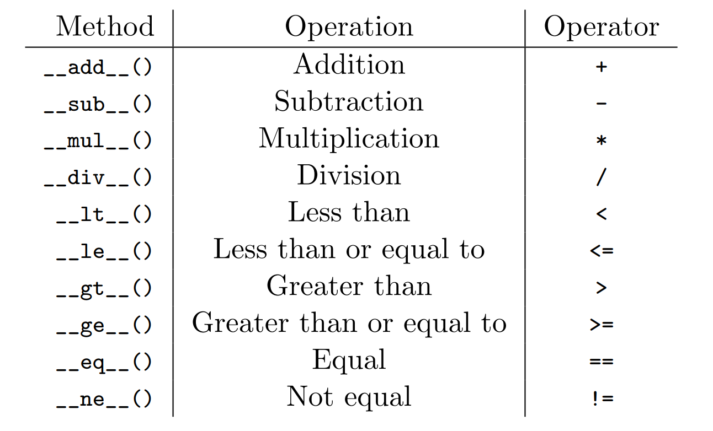

<!--
$theme: gaia
template: invert
-->

# Week 3 - Classes (not the school kind)

###### Based on notes from BYU's ACME Program: [Link](http://www.acme.byu.edu/wp-content/uploads/2016/08/OOP.pdf)

---

### What are Classes

- A critical element of object-oriented programming
- Directions for creating objects
	- A list of "recipes" for utilizing that object
- Allow us to generate multiple related objects, and to manipulate them, quickly and efficiently

---

### Classes

Let's imagine we work at a cafeteria, and that we want to represent a sandwich as code. There are certain things we would want to know about every sandwich:
1) Whose is it?
2) What toppings will we put on our sandwich?
3) What kind of bread will we use?

How can we start designing our sandwich code?


---

### Creating a New Class

```python
class Sandwich(object):
	def __init__(self, owner, bread='white'):
    		self.owner = owner
		self.bread = bread
		self.toppings = []
```

The FIRST thing we need to do is to initialize an object of class ```Sandwich```. We do this by using the ```__init__()``` method (methods are functions assigned to a particular class of objects)
- We tell our object what arguments to expect, and store these values as **attributes** of our object

---

### Creating a New Class

```python
>>> mine = Sandwich('Dusty')
>>> print(mine)
<__main__.Sandwich object at 0x7f83ba7cc390>
```

So, I created a delicious sandwich class, but I can't print anything about it!
- We have to explain to the interpreter how to implement basic functions using our object
- We can declare basic functionality using *magic methods*

---

### Magic Methods (more [here](https://www.python-course.eu/python3_magic_methods.php))



---

### Magic Methods Note

In Python 3, there are 2 different division magic methods:

- `__truediv__` represents the functionality of the '/' operator
- `__floordiv__` represents the functionality of the '//' operator

---

### Magic Methods

Not all of the magic methods will make sense for all classes. Which standard operations do you think would make sense for our ```Sandwich``` class?

---

### Magic Methods

Not all of the magic methods will make sense for all classes. Which standard operations do you think would make sense for our ```Sandwich``` class?

- Adding (we can ADD toppings)
- Subtracting (we can REMOVE toppings)
- Equality (we can determine if two sandwiches are the same)
	- If we define equality, we should also define when two sandwiches are NOT equal.
- A string format for printing (not on our list above)

---

### Magic Methods - Adding

```python
class Sandwich(object):
  def __init__(self, owner, bread='white'):
    self.owner = owner
    self.bread = bread
    self.toppings = []
  def __add__(self, topping):
    return self.toppings.append(topping)
```

Here, we add the magic method for addition to our class, and state that the ```+``` operator should append the topping that follows it to our list of toppings, then return that updated list.

---

### Magic Methods - Subtracting

```python
class Sandwich(object):
  def __init__(self, owner, bread='white'):
    self.owner = owner
    self.bread = bread
    self.toppings = []
  def __add__(self, topping):
    return self.toppings.append(topping)
  def __sub__(self, topping):
    if topping in self.toppings:
      return self.toppings.remove(topping)
    else:
      print("Topping not present, and can't be removed.")
```

Subtracting is trickier, but we need to declare that the ```-``` operator should check for a topping in our list, and remove it if present.

---

### Magic Methods - (In)Equality

```python
class Sandwich(object):
  def __init__(self, owner, bread='white'):
    self.owner = owner
    self.bread = bread
    self.toppings = []
  ...  # This is where the add and sub methods are
  def __eq__(self, other):
    if (self.bread==other.bread) and 
      (sorted(self.toppings) == sorted(other.toppings)):
      return True
    else:
      return False
  def __ne__(self, other):
    return not (self == other)
```

Remember that we have to declare both ``=`` and ``!=``

---

### Magic Methods - Strings

```python
class Sandwich(object):
  def __init__(self, owner, bread='white'):
    self.owner = owner
    self.bread = bread
    self.toppings = []
  ...  # Other magic methods here
  def __repr__(self):
    alltops = "Toppings:\t"
    for i in self.toppings:
      alltops += " %s" % i
    return "Owner:\t\t "+ str(self.owner) +"\n" + 
      alltops + "\nBread:\t\t " + self.bread
```

Now we can print our sandwich!

---

### Methods - Try It!

We can also create methods that are based on the unique functionality of our class of objects. Since we are working at a *store*, we might care about pricing a given sandwich.
- Let's call the method ``get_price``, and have it take two arguments (itself and a discount) with a default value of ``0``, and store ``price`` as an attribute
- Each topping costs $1
- Specialty bread (not white bread) is $2, white bread is provided at no cost


---

### Methods

Possible Answer:

```python
class Sandwich(object):
  def __init__(self, owner, bread='white'):
    self.owner = owner
    self.bread = bread
    self.toppings = []
  ...  # Magic methods go here
  def get_price(self, discount=0.0):
    self.price = 0
    for i in self.toppings:
      self.price += 1
    if self.bread != 'white':
      self.price += 2
    if discount > 0:
      self.price *= (1-discount)
    return self.price
 ```
 
 ---
 
 ### Documenting
 
 When we create a class, a function, or a method, we should be sure to **document** that object!
 - We can then remember how to use it after long breaks
 - Other people can make use of our code without having to decipher each line

We can document by modifying the *docstring* of an object.

---

### Documenting

```python
class Sandwich(object):
  """A class defining a sandwich. Toppings can be added
  and removed, and the owner and bread type can be 
  declared upon initiation.
  
  Attributes:
    owner (str): the person puchasing the sandwich
    bread (str): the type of bread to be used
    toppings (list): a list of the toppings (str) that
      are to be put on the sandwich
    price (float): the price of the sandwich
  """
  def get_price(self):
  ... # Class continues below
```

---

### Documenting

```python
class Sandwich(object):
  ... # Docstring for Sandwich class
  def get_price(self, discount=0.0):
    """A function to calculate the price of the sandwich.
    Each topping costs $1, and bread that is not 'white'
    costs $2. Discounts should be applied as the amount
    to be deducted.
    
    Inputs:
      discount (float): amount to be discounted from 
        total price
    
    Returns:
      A Sandwich object with a price attribute
    """
    ...
    return self.price
```

---

###### Extra Practice!

<font size=4>

Create your own ``ComplexNumber`` class!
1. Complex numbers have a real and an imaginary part. The ``__init__()`` method should therefore accept two numbers. Store the first as self.real and the second as self.imag.
2. Implement a ``conjugate()`` method that returns the object's complex conjugate (as a new ``ComplexNumber`` object). Recall that $a + bi = a - bi$.
3. Add the following magic methods:
 	- ``__abs__()`` determines the output of the builtin ``abs()`` function (absolute value). Implement ``__abs__()`` so that it returns the magnitude of the complex number. Recall that $|a + bi| = \sqrt{a^2 + b^2}$.
 	- Implement ``__lt__()`` and ``__gt__()`` so that ``ComplexNumber`` objects can be compared by their magnitudes. That is, $(a + bi) < (c + di)$ if and only if $|a + bi| < |c + di|$, and so on.
 	- Implement ``__eq__()`` and ``__ne__()`` so that two ``ComplexNumber`` objects are equal if and only if they have the same real and imaginary parts.
 	-  Implement ``__add__()``, ``__sub__()``, ``__mul__()``, and ``__div__()`` appropriately. Each of these should return a new ``ComplexNumber`` object.

</font>