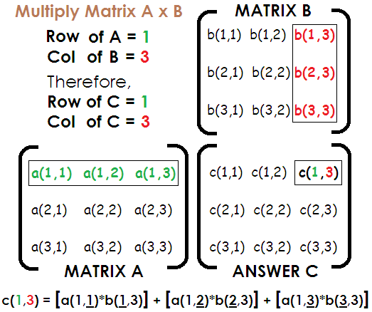

<!--
$theme: gaia
template: invert
-->

# Week 4 - Numeric Python (Numpy)

---

### Arrays and Math

While we know that arrays and lists exist in Python, we have not yet tried to do any real computation with those tools.

Let's get started by doing some simple computations:

- Calculate the dot product of two vectors of equal length
- Multiply two conforming matrices

---

### Dot Product

The **dot product** of two vectors is the sum of the products of the corresponding elements in each vector. We can write it as follows:

$$ a \cdot b = \sum_{i=1}^N a_i \times b_i $$

Take 5 minutes, and write a function to take two vectors of any (equal) length, and calculate the dot product. 

---

### Dot Product

```python
def dotProd(v1, v2): # Define our function and arguments
  if len(v1) is len(v2): # Test equality of vector length
    dp = 0               # Initialize Dot Product Value
    for i in range(len(v1)): # Loop over all elements
      dp += v1[i]*v2[i]      # Add elements of the sum
    return dp            # Return the dot product
  else: # If vetors are of unequal length, return error
    raise RuntimeError("Vectors must be of equal length")
```

This code allows us to calculate the dot product.

---

### Matrix Multiplication

We can multiply two matrices when the number of columns in the first matrix are equal to the number of rows in the second matrix:

- $A$ is an $m \times n$ matrix (has $m$ rows, $n$ columns)

- $B$ is an $n \times q$ matrix (has $n$ rows, $q$ columns)

In this case, the matrices are conforming, and can be multiplied together

- The resulting matrix, $C$ is an $m \times q$ matrix

---

### Matrix Multiplication

$$
A =
  \begin{bmatrix}
    1 & 2 \\
    3 & 4
  \end{bmatrix}, 
B =
  \begin{bmatrix}
    6 \\
    5
  \end{bmatrix}
$$

Matrix $A$ has 2 columns, and $B$ has 2 rows (conforming).

$$ 
AB = C = 
  \begin{bmatrix}
    16 \\
    38
  \end{bmatrix} 
$$

$$ =
  \begin{bmatrix}
    1\cdot 6 + 2\cdot5 \\
    3\cdot 6 + 4\cdot5
  \end{bmatrix}
  
$$

---

### Matrix Multiplication

$$
A =
  \begin{bmatrix}
    a_{1,1} & \cdots & a_{1,m}\\
    \vdots & \ddots & \vdots\\
    a_{n,1} & \cdots & a_{n,m}
  \end{bmatrix}, 
B =
    \begin{bmatrix}
    b_{1,1} & \cdots & b_{1,p}\\
    \vdots & \ddots & \vdots\\
    b_{m,1} & \cdots & b_{m,p}
  \end{bmatrix} 
$$

Matrix $A$ has $m$ columns, and $B$ has $m$ rows (conforming). C will have shape $n \times p$

$$
  c_{ij} = \sum_{k=1}^m a_{ik} \times b_{kj}
$$

We calculate all elements of $C$ in this manner

---

### Matrix Multiplication

<center>
</img>
</center>

---

### Matrix Multiplication

Matrix $A$ has $m$ columns, and $B$ has $m$ rows (conforming). C will have shape $n \times p$

$$
  c_{ij} = \sum_{k=1}^m a_{ik} \times b_{kj}
$$

Write an algorithm (maybe even recycling your dot product function!) to perform arbitrary matrix multiplication given two conforming matrices.

---

```python
def matMul(a, b): # Define function, take 2 matrices
  for i in range(len(a)): # Make sure a is matrix
    if len(a[i]) is not len(a[0]): # If not,
      raise RuntimeError( # Raise an error
        "Matrix A is not correctly specified")
  for i in range(len(b)): # Make sure b is a matrix
    if len(b[i]) is not len(b[0]): # If not,
      raise RuntimeError( # Raise an error
        "Matrix B is not correctly specified")
  matrix = [] # Initialize new empty matrix
  if len(a[0]) is len(b): # Test for conformability
    for i in range(len(a)): # Iterate over rows of a
      row = [] # Create row of new matrix
      for j in range(len(b[0])): # Iterate over columns
        row.append(dotProd(a[i], # Append elements of col
          [b[n][j] for n in range(len(b))]))
      matrix.append(row) # Append rows to matrix
    return matrix # Return the newly calculated matrix
  else: # If matrices are nonconforming
    raise RuntimeError( #Raise an error
      "Matrices are nonconformable for multiplication")
```

---

### Computations and Python

It is great that Python is so flexible that we can quickly write functions to do calculations like matrix multiplication.
- Do we WANT to write out functions to do all of the mathematical processes we need for different kinds of analysis?
	- Random number generators?
	- Matrix inversion algorithms?
	- Solving matrix equalities?


---

### Numeric Python (Numpy)

Even better than writing our own algorithms are libraries with pre-written (and far more efficient) algorithms to solve complex mathematical problems.

The `numpy` library is the principal library for mathematical computation in Python.

[Numpy Reference Page](https://docs.scipy.org/doc/numpy/reference/index.html)

---

### Numpy - Arrays

The building blocks of `numpy` are arrays. Arrays are a special object type that takes data and stores it in formats that allow us to more easily apply mathematical functions to that data. We will focus on creating arrays in two ways:
1) Creating arrays by coercing lists and tuples to the array type
2) Creating arrays using `numpy` commands

---

### Numpy Arrays - List Coercion

```python
>>> import numpy as np # import library as np object

>>> myList = [1, 2, 3, 4]

>>> myArray = np.array(myList)
>>> myArray
array([1, 2, 3, 4])
```

We can use the `np.array` function to generate an array from any arbitrary list (or tuple) of numbers


---

### Numpy Arrays - Using Commands

```python
>>> np.array([1,2,3,4]) # Specify each element
array([1, 2, 3, 4])
>>> np.zeros((3,3)) # Generate 3 x 3 array of zeros
array([[ 0.,  0.,  0.],
       [ 0.,  0.,  0.],
       [ 0.,  0.,  0.]])
>>> np.eye(3) # Generate 3 x 3 identity matrix
array([[ 1.,  0.,  0.],
       [ 0.,  1.,  0.],
       [ 0.,  0.,  1.]])
```

The `array`, `zeros`, and `eye` functions are all ways to create arrays in `numpy`. There are many more functions that we can use to generate arrays.


---

### Numpy Arrays - Manipulation

```python
>>> myArray = np.array([1,2,3,4]) # Specify each element
>>> np.shape(myArray)
(4,) # A vector with 4 elements
>>> myArray = np.array([[1,2,3,4]])
>>> np.shape(myArray)
(1, 4)
>>> myArray.reshape((2,2)) # transform to square matrix
array([[1, 2],
       [3, 4]])
>>> myArray.reshape((4,1)) # transform to column vector
array([[1],
       [2],
       [3],
       [4]])
>>> myArray = np.array([[1,2,3,4]])
>>> myArray.T # transposes the array if 2-D
```

---

### Numpy Arrays - Operations

Add a scalar to an array:
```python
>>> newArray = np.array(myArray) + 1
array([2, 3, 4, 5])
```

Add (or subtract) arrays:
```python
>>> myArray - newArray # must have same shape
array([[-1, -1, -1, -1]])
```
Matrix Multiplication:
```python
>>> myArray.T.dot(myArray) # to get 4 x 4 product
>>> myArray.dot(myArray.T) # to get scalar (dot) product
```
