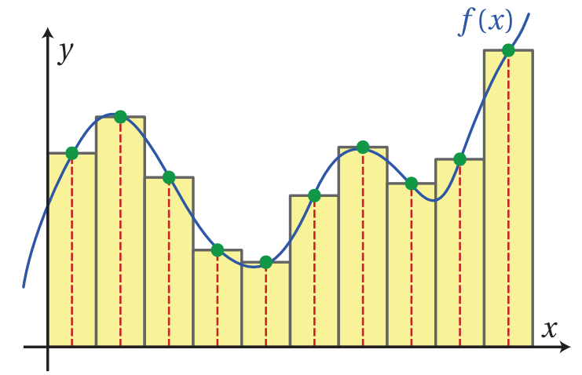
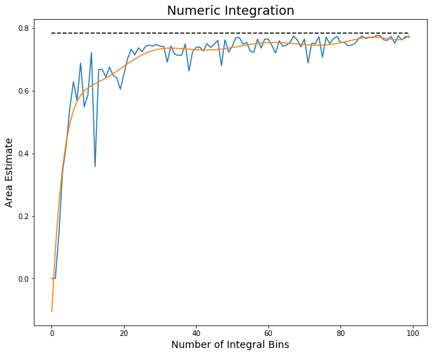

<!--
$theme: gaia
template: invert
-->

# Week 6 - Multiprocessing

###### Based on notes from sebastianraschka.com: [Link](http://sebastianraschka.com/Articles/2014_multiprocessing.html)

---

### How do Programs Work?

1) Computer allocates memory to the program
2) Program issues a series of instructions to the processor
3) Upon completion of one instruction, the next is started
4) Information is returned to the program as needed
5) New instructions are sent to the processor
6) Return to step 2, repeat until program is finished

---

### How do Programs Work?

It is important to note that when a program is running, it typically has a single space in memory in which it stores all relevant information.

- This allows the information to be used by whichever part of the program requires that information to use it.
	- This is true for globally defined values
	- Variables with reduced **scope** are not available to all segments of a program


---

### Aside: Scope

**Scope** is a term used to define the areas in which a given value in memory is accessible.

- Variables that are **Global** in scope can typically be accessed by any function or command running as part of the program
- Variables that are **Local** can only be accessed within the scope in which they are defined
	- A variable created inside a function is **local** to that function, and only available until the function is concluded.

---

### Serial vs Parallel


---

### Serial Programs

When we perform calculations, some steps MUST be performed sequentially.

- We need to estimate regression coefficients before we can estimate standard errors on those coefficients
- We need to fit a machine learning model before we can use it to make predictions
- We need to aim our Halo rocket launcher prior to pulling the trigger

---

### Serial Programs

Generally, many tasks are required to be performed sequentially, since subsequent actions or calculations are dependent on the result of prior calculations.

- It is critical that the results of one calculation be within the **scope** of the other calculations
- If one calculation cannot view the results of the other, then the second function typically cannot be completed

---

### Parallel Programs

Some calculations can be performed independent of the results of other steps:

- Batch processing of files
- Non-sequential simulations
- Repeated random draws
- Rendering polygons


---

### Parallel Programs

The key difference between serial and parallel programs is determining the dependency of calculations on the results of calculations previously completed.

- Serial programs tend to rely on previous results
- Parallel programs do not depend on the results of other calculations

Parallel programs can (obviously) occur simultaneously, allowing us to accelerate execution


---

### Example - Numeric Integration

Often, when integrating complicated functions, there is no **algebraic** solution to the integral. This means that we need to estimate the value of the integral **numerically**.

1) Choose points at which to estimate the value of the function
2) Choose bandwidth
3) Multiply function values by bandwidth
4) Add all estimates to calculate approximate integral

---

### Example - Numeric Integration



---

### Example - Numeric Integration


```python
import numpy as np 
import multiprocessing as mp # This module is part of the
			     # python standard library

# define any function here!
def f(x):
    # return the value of the function given x
    return 1/(1 + x**2)
```

The ``multiprocessing`` library is designed to create separate instances of the python interpreter, each returning values that are independent of the other instances


---

### Example - Numeric Integration

```python
def integral(nSample, f, xmin, xmax):
  # determine points of estimation
  sample = np.sort(np.random.uniform(xmin, xmax, nSample))
  # Calculate height at each point
  value = f(sample)
  # Calculate areas, sum
  area = np.sum(np.diff(sample) * value[1:])
  area += sample[0] * value[0]
  # Return integral
  return (nSample, area)
```

This is our function for actually integrating a function `f` from `xmin` to `xmax` across `nSample` random intervals.

---

### Example - Numeric Integration



---

### Example - Numeric Integration

```python
def serial(samples, f, lb, ub):
  return [integral(s, f, lb, ub) for s in range(samples)]
    
def multiprocess(processes, samples, f, lb, ub):
  pool = mp.Pool(processes=processes)
  results = [pool.apply_async(integral, 
    args=(s, f, lb, ub)) for s in range(samples)]
  results = [p.get() for p in results]
  results.sort() # to sort the results
  return [results[x][1] for x in range(len(results))]
```

We specify two functions to estimate integrals of `f`. One does so using serial code, the other parallelizes the estimates.

---

### Example - Numeric Integration

```python
def multiprocess(processes, samples, f, lb, ub):
  pool = mp.Pool(processes=processes)
  ...
  return ...
```

The `multiprocessing.Pool` class allows us to define the degree to which we want to spread our work across various **processes**

- We need to take care to choose the right number of processes for our machine!

---

### Example - Numeric Integration

```python
def multiprocess(processes, samples, f, lb, ub):
  ...
  results = [pool.apply_async(integral, 
    args=(s, f, lb, ub)) for s in range(samples)]
  ...
  return ...
```

We next use the `apply_async` method to pass the values that we want our pooled instances to calculate
- Need to provide the function to be executed, as well as the arguments for the function

---

### Example - Numeric Integration

```python
def multiprocess(processes, samples, f, lb, ub):
  ...
  results = [p.get() for p in results]
  ...
  return ...
```
The next step is to use the `get()` method on each element of our returned processes. This will fetch the return statement values from each of the processes that we executed in the last line.

---

### Example - Numeric Integration

```python
def multiprocess(processes, samples, f, lb, ub):
  ...
  results.sort() # to sort the results
  return ...
```
Remember when we included two elements in our `return` statement for the `integrate` method? We now sort our results based on the `nSample` value, so that we have our integral estimates in order from lowest number of intervals to highest (so that we can track convergence)

---

### Example - Numeric Integration

```python
def multiprocess(processes, samples, f, lb, ub):
  ...
  return [results[x][1] for x in range(len(results))]
```
<br>

We don't need the first element in each array anymore (it's already sorted), so we return the second element in each result as a list. It will look just like the results from our `serial` method

---

### Example - Timing it

```python
import timeit # library for timing execution of code

benchmarks = [] # list to store our execution times

benchmarks.append(timeit.Timer('serial(10000, f, 0, 1)',
  'from __main__ import serial, f').timeit(number=1))
    # Note that we need to include a second line
    # that imports our functions from __main__.
    # This tells the timer what needs to be IN SCOPE

benchmarks.append(timeit.Timer(
  'multiprocess(2, 10000, f, 0, 1)',
  'from __main__ import multiprocess, f').timeit(
    number=1))
    # Need to include number of processes
    # when timing the parallel implementation
```

---

<!--
$theme
template:
-->

### Example - Timing it


---

<!--
$theme:gaia
template: invert
-->

### Example - Timing it

The parallel version of this problem executes over 5x faster than the serial version

- This was done on a 16-core processor
- Creating too many processes (going past 16 to 32) actually started to slow the computations down
- We need to be aware of the hardware that we are utilizing when designing parallel code

```python 
mp.cpu_count() # Tells us the number of available CPUs
```

---

### Lab Today

Draw from the normal distribution using `numpy`

```python
import numpy as np

# Make 100 draws from the standard normal distribution
# Mean: 0
# SD: 1
# Number of draws: 100
randNormals = np.random.normal(0, 1, 100)
```

Notation for a normal distribution with mean 0 and variance (std. dev. squared) of 1 is

$$ X \sim \mathcal{N}(0,1) $$


---

#### Lab Today

<font size=5>

Simulate 100,000 draws from a multivariate normal distribution

$$ y_i = \alpha + x_{1i} + 2\cdot x_{2i} + \frac{1}{2}x_{3i} + \epsilon_i $$

where

$$ \alpha \sim \mathcal{N}(15,2) $$
$$ x_1 \sim \mathcal{N}(3,5) $$
$$ x_2 \sim \mathcal{N}(10,1) $$
$$ x_3 \sim \mathcal{N}(8,8) $$
$$ \epsilon \sim \mathcal{N}(0,1) $$

Write functions to generate all values and calculate $y$. Test and time these draws using serial and parallel programming, and report the difference in performance between the two versions.