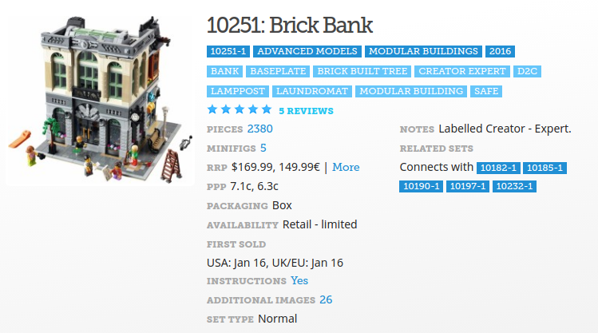
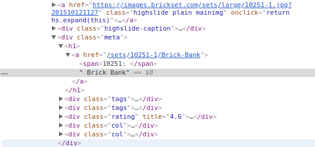
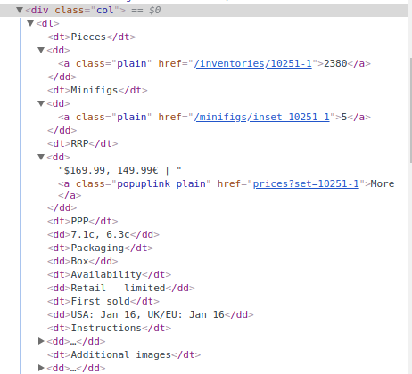

<!--
$theme: gaia
template: invert
-->

### Web Scraping for Data Collection
###### Inspired by code from [tsvm](https://github.com/tsvm/scrapy-etsy-demo/blob/master/etsydemo/spiders/etsy_spider.py) and [Digital Ocean](https://www.digitalocean.com/community/tutorials/how-to-crawl-a-web-page-with-scrapy-and-python-3)


---

### Data Collection

Sometimes, our data comes in a nice and clean format:

- [ipums.org](https://www.ipums.org/) - Census Bureau Data
- [collegescorecard.ed.gov](https://collegescorecard.ed.gov/data/) - Education Data
- [gss.norc.org](http://gss.norc.org/) - General Social Survey

---

### Data Collection

Sometimes, not so much...

```html
<p class="text-gray text-truncate mb-xs-0 text-body">
Dungeons and Dragons Your Stick Figure Family rolled a 1 / D20 vinyl  Dragon decal / RPG / vinyl sticker for cars windows / gifts for geeks
</p>
<div class="v2-listing-card__shop">
<p class="text-gray-lighter text-body-smaller display-inline-block mr-xs-1">FlairdeGeek</p>
<div class="v2-listing-card__rating icon-t-2">
<div class="stars-svg stars-smaller ">
<input type="hidden" name="initial-rating" value="4.985">
<input type="hidden" name="rating" value="4.985">
<span class="screen-reader-only">5 out of 5 stars</span>
```

[Searched "dungeons and dragons" on Etsy](https://www.etsy.com/search?q=dungeons%20and%20dragons&ref=auto1&as_prefix=dun)


---

### What can we do?

We need data, but it is embedded in a web site, and wrapped in lots of HTML code.

- Download all of the code from the webpage and manually cut out the information?
- Copy and paste from the tables on a rendered website?


This might be feasible on a small scale, but what if I want to know about information stored on 1000's of pages?

---

### Web Scraping

**Web Scraping** is the process of extracting information from web pages.

- Irregular
- Interactive
- Iterative

No webpage is designed the same as any other (typically), so we have to build an understanding of the pages we want to scrape before we can write our code.


---

### What to Know

In order to scrape a web page, we need to have a basic understanding of:

- [HTML tags](https://www.youtube.com/watch?v=ofox_6_-gGo)
- [CSS formatting](https://medium.com/actualize-network/modern-css-explained-for-dinosaurs-5226febe3525), ([here also](https://www.youtube.com/watch?v=tSv2KIF7uE4&list=PLAwxTw4SYaPmd5v7c9i883AwqVZquegHM&index=9))
- [JSON data structures](https://www.youtube.com/watch?v=N7svaYUZWNA)

From there, we will spend LOTS of time on Google making sure we get it right for the page(s) that we care about.

---

### Brickset

Let's say that I want to collect information about lots of different Lego sets.




---

### Brickset

This is a good page to learn scraping, because we also have the option of getting our search results back as a CSV, so we can check whether or not we collect the correct information.

Say we want to collect
- Set name
- \# of Pieces
- \# of Minifigs (Lego people)
- The URL of a picture of the set

---

### Brickset

We need to 
1) Identify the pieces of HTML that surround the information we need, 
2) Create code that will allow us to extract that information 
3) Create code that can do this for all pages

<br>

Let's go to the [Brickset website](https://brickset.com/sets/year-2016) to find what we are looking for

---

### Our Objects of Interest

In order to find the way in which information is stored in the Brickset page, we will use our browser's developer tools to explore the page source.

<br>

Right click on the name ("10251: Brick Bank") of the first lego set after you follow the link, and choose the **Inspect** option


---

### Our Objects of Interest

</img>

We can see that the set's name is inside of an `<h1>` tag, as well as an `<a>` tag (header and link tags, respectively)

---

### Our Objects of Interest

If we continue further, we will see that most other information is contained in a list:

<center>
</img>
</center>

---

### Extracting the Data

In order to write code that will retrieve this data from each search result, we will use the `scrapy` library.

1) Create our spider (code to **crawl** a **web**site) as a **subclass** of the `scrapy.Spider` class
2) Customize that class to detect the data we care about
3) From a command prompt, set our spider loose on the sites we are scraping

---

### Extracting the Data

```python
import scrapy

class BrickSetSpider(scrapy.Spider):
  name = "brickset_spider"
  start_urls = [
        'http://brickset.com/sets/year-2016'
        ]
```

Let's start by creating our class, and giving it a helpful name.

We then need to tell our spider where it will start crawling.


---

### Extracting the Data

Next, we need to create a header for our CSV, so that it is clear what each column of extracted data contains:

```python
with open('myresults.csv', 'w') as f:
        f.write("name, pieces, minifigs, image\n")
```

This also goes inside of our `BrickSetSpider` class.


---

### Extracting the Data

Now, define a method named `parse`. This method will be called for each web page that is crawled by the spider, and will perform some operations (that we need to specify) for each `.set` object.

```python
def parse(self, response):
  with open('myresults.csv', 'a') as f:
    SET_SELECTOR = ".set"
    for brickset in response.css(SET_SELECTOR):
      ...
```

---

### Extracting the Data

We need to identify where the name, pieces, minifigs, and image information are stored. We will use this to direct our spider to collect that information.

```python
def parse(self, response):
  with open('myresults.csv', 'a') as f:
    SET_SELECTOR = ".set"
    for brickset in response.css(SET_SELECTOR):
      NAME_SELECTOR = 'h1 ::text'
      PIECES_SELECTOR = './/dl[dt/text() = "Pieces"]/dd/a/text()'
      MINIFIGS_SELECTOR = './/dl[dt/text() = "Minifigs"]/dd[2]/a/text()'
      IMAGE_SELECTOR = 'img ::attr(src)'
      ...
```

---

### Extracting the Data

Now, we need to collect the information we care about, extract the values, and then store them as a row in our new csv.

```python
def parse(self, response):
  with open('myresults.csv', 'a') as f:
    SET_SELECTOR = ".set"
    for brickset in response.css(SET_SELECTOR):
      ...
      result = str(brickset.css(NAME_SELECTOR).extract_first()) + ","
      result += str(brickset.xpath(PIECES_SELECTOR).extract_first()) + ","
      result += str(brickset.xpath(MINIFIGS_SELECTOR).extract_first()) + ","
      result += str(brickset.css(IMAGE_SELECTOR).extract_first()) + "\n"
                        
      f.write(result)
      ...
```

---

### Extracting the Data

Finally, if our results spill beyond a single page, we need to specify how to move to the next page of results.

```python
def parse(self, response):
  with open('myresults.csv', 'a') as f:
    SET_SELECTOR = ".set"
    for brickset in response.css(SET_SELECTOR):
      ...
      NEXT_PAGE_SELECTOR = '.next a ::attr(href)'
      next_page = response.css(NEXT_PAGE_SELECTOR).extract_first()
      if next_page:
        yield scrapy.Request(
          response.urljoin(next_page),
          callback=self.parse
        )
```

---

### Running Our Spider

In order to run our Spider, we will need to open a Terminal/PowerShell/Command Prompt:

Lab Computers/Windows:
```powershell
python C:\ProgramFiles\Anaconda3\Scripts\scrapy 
                                  runspider bricks.py
```

Mac/Unix/Linux:
```bash
scrapy runspider bricks.py
```

In both cases, we need to be in the directory containing our `bricks.py` script


---

### Learning What We Need

How can we try different selectors out until we get the right ones?

We can run the `scrapy` shell.

Unix/Linux:
```bash
scrapy shell
```

Windows (in the lab):
```bash
python C:\ProgramFiles\Anaconda3\Scripts\scrapy shell
```

---

### Another (harder) Crawl

In the case of Brickset, the data that we want to collect is relatively easy to access. This is certainly not going to be the case for every website.

- Let's take a look at scraping some data from a search on [Etsy.com](https://www.etsy.com/search?q=dungeons%20and%20dragons&ref=auto1&as_prefix=dungeons%20)

- Let's say that we are interested in collecting the URL, name, an image of the item, item description, lowest price listed, and average rating

---

### Etsy Crawl

1) Find where the information we want is stored
2) Determine the structure of our crawl
3) Write code to move through all the necessary pages
4) Write code to break down the information on each page

<br>

You can take a look at an example scrape of Etsy in [this script](https://raw.githubusercontent.com/dustywhite7/Econ8320/master/LabCode/etsyscrape.py)

---

### Lab/Homework For This Week

This week, your homework is to scrape Brickset for some collection of Lego sets (of your choice)

Turn in: Your spider script (see my examples) named `mySpider.py`, as well as a CSV containing the results from your scrape, named `results.csv`. You will only get credit if your script runs without errors, and returns the data that you have provided in the CSV.

I will write a script that tests whether or not your script returns a CSV that is equivalent to the CSV you turn in.