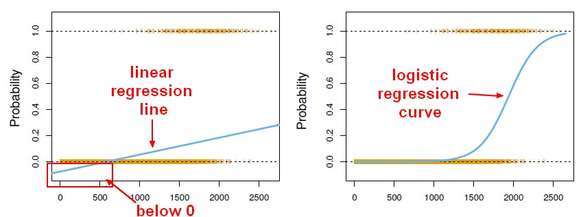

# Logistic Regression Primer
### Or, how to implement your own Logit

---

### Logistic Regression

What if we transform our regression model in a way that requires it to remain within the $[0,1]$ interval?

---

### Logistic Regression

 

- We no longer have a linear function (linear functions are not bounded to our unit interval)
- We no longer assume that treatments have constant effect
- **But** our output can now be interpreted as 
$$p(y=1)$$

---

### Logistic Transformation

 

The transformation that is required in order to coerce our output to remain between 0 and 1 is

$$p(y=1|x)=\frac{exp(x'\beta)}{1+exp(x'\beta)} = \Lambda(x'\beta)$$

and is called the **logistic transformation**.

---

#### Maximum Likelihood Estimation

OLS Log-Likelihood function:

$$ ln\;\mathcal{L}(\theta|y, x) = -\frac{n}{2}ln(2\pi) -\frac{n}{2}ln(\sigma^2) - $$
$$\frac{1}{2\sigma^2}(y-x\beta)'(y-x\beta)  $$

Logistic Log-Likelihood function:

$$ ln\;\mathcal{L}(\theta|y, x) = \sum_{i=1}^n (y_i\;ln (\Lambda(x_i'\beta)) + $$

$$ (1-y_i)\; ln (1-\Lambda(x_i'\beta))) $$
---

### Simplifying the Likelihood Function

In order to calculate the likelihood value, we should calculate the value of gamma, plug it into the likelihood for each observation, and then add the values up

- Write a for loop to calculate the likelihood for each observation
- Add up the resulting values
- Return the negative sum as the log-likelihood value
	- We want to calculate the MAXIMUM likelihood, but need to use a MINIMIZATION algorithm

---

### Using our $\beta$s

Once we have a function to calculate the log-likelihood, we can simply plug that function into `scipy.minimize` and return the $\beta$ coefficients to our model.

---

### Using our $\beta$s to Estimate Standard Errors

In order to calculate the model variance for our Logistic Regression, we can use a much simpler process than for OLS:

$$ \hat{\sigma^2} = n\cdot p (1-p) = n\cdot \bar{y}(1-\bar{y}) $$

Using this value, we can then estimate our variance-covariance matrix:

$$ Cov(\hat{\beta}) = \hat{\sigma^2} (X'X)^{-1} $$

---

### How About Significance Tests?

Instead of the t-statistic and Student's T-Distribution used with OLS, our Logit model will use z-statistics and the Normal Distribution. Don't forget that $\hat{\sigma}$ comes from the square root of the main diagonal of $Cov(\hat{\beta})$.

$$ Z = \frac{\hat{\beta}}{\hat{\sigma}} $$

We can test this statistic against the Normal distribution with a mean of 0 and variance of 1.

