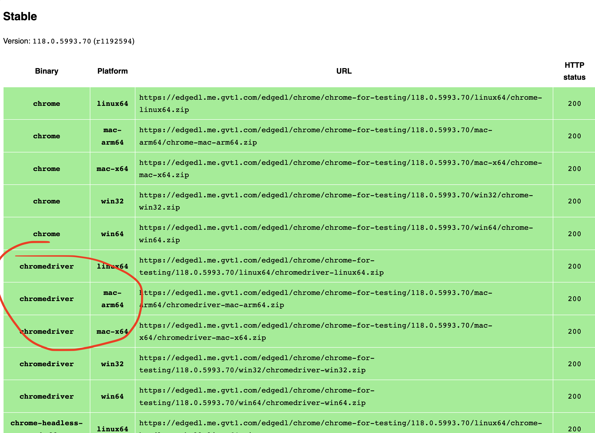
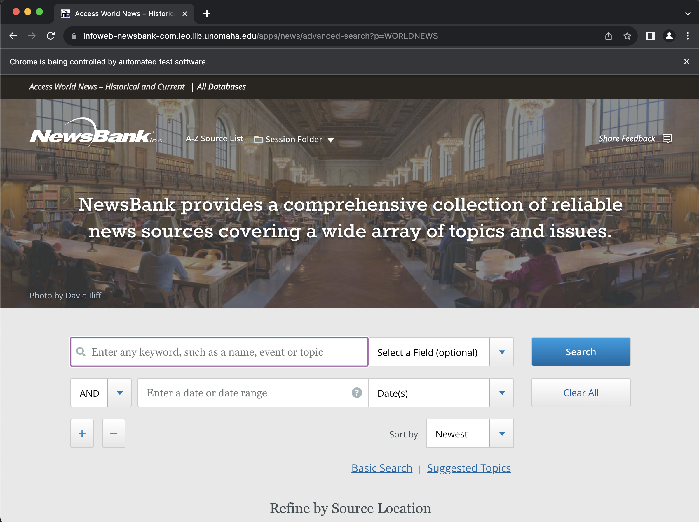
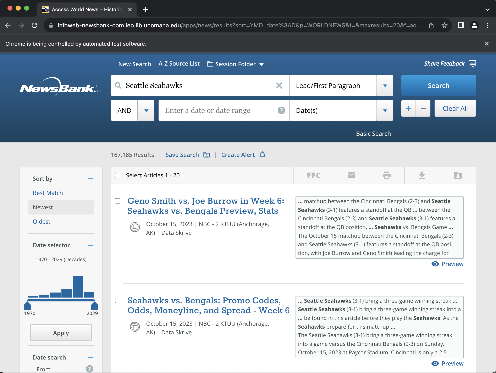

# Using Selenium to do $fancy$ scrapes

---

# Bots and Scraping


---

# Bots and Scraping

Most modern websites are designed to prevent automated tools from extracting their information.

Additionally, some modern pages employ tools such as infinite scrolling (like social media platforms, etc.)

---

# Selenium

[Selenium](https://selenium-python.readthedocs.io/) is a toolkit that can be used both for testing website behavior and for interacting with websites. We can use it to:
- Load a page in browser
- Access information on that page
- Scroll
- Click
- Do other user-like actions

---

# Getting set up

You must have a **local** install (on your computer) of Python to follow this tutorial. If you need to download Python, I recommend using [Anaconda Python](https://www.anaconda.com/download#downloads)

In the terminal:
```python
pip install selenium
```

On your computer:
- Have Chrome/Chromium installed
- Download the driver from [this page](https://googlechromelabs.github.io/chrome-for-testing/#stable)

---

# Chrome driver



---

# Chrome driver placement

Put the downloaded file into your script directory (the folder from which your code will be run)

For Windows:
- The file is named `chromedriver.exe`

For Mac/Linux
- The file is named `chromedriver`

---

# Beginning our scrape

We will try scraping some news articles from resources hosted by the UNO library.

**YOU MUST USE YOUR UNO ACCOUNT TO LOG IN**

---

# Launching Chrome

```python
from selenium import webdriver
from selenium.webdriver.common.keys import Keys
from selenium.webdriver.common.by import By

# Mac/Linux
driver = webdriver.Chrome(executable_path="chromedriver")

# Windows
# driver = webdriver.Chrome(executable_path="chromedriver.exe")
```

When this code has completed you should have an empty web browser open on your computer. It should have a notice that states "Chrome is being controlled by automated test software."

---

# Open a website

We want to open a news aggregator that we can search through and scrape from. The code below will open the link to the NewsBank database. You will then need to log in with your UNO credentials and two-factor authentication.

```python
driver.get("https://infoweb-newsbank-com.leo.lib.unomaha.edu/
apps/news/advanced-search?p=WORLDNEWS")
```

---



---

# Manual search

For our purposes, we can simply initiate a manual search based on our desired criteria. I'll try looking for news articles where the "Seattle Seahawks" are mentioned in the lead.

---



---

# Finding the article links

Next, I want to find all of the articles on the page:

```python
# Identify the <body> of the html
body = driver.find_element(By.TAG_NAME, "body")

# Identify <article> tags
art_tags = body.find_elements(By.TAG_NAME,'article')

# Search for the <h3> tags containing the links
#   and then extract the href attributes
links = [i.find_element(
    By.TAG_NAME, "h3").find_element(
        By.TAG_NAME, 'a').get_attribute("href") for i in art_tags]

# Find the link to the next page to keep searching
next_page = driver.find_element(
    By.CLASS_NAME, "pager__item--next").find_element(
        By.TAG_NAME, 'a').get_attribute("href")
```

---

# Pull article text

Next, I want to follow each link on that page to extract the article text:

```python
# Container for the data
articles = []

# Loop over links
for i in links:
    # Fetch the page
    driver.get(i)

    # Make a single string containing all paragraphs of text
    single = " ".join(
        [i.text for i in driver.find_element(
            By.CLASS_NAME, "document-view__body").find_elements(
                By.TAG_NAME, 'p')])
    
    # Stick it into the container list            
    articles.append(single)
```

---

# To Be Continued?

If I wanted to keep going, I could write code very similar to our Lego scraping code to advance to the next page of results, and extract those articles as well!

In the end, we have our own custom text data set that we can use in our research!

---

# When finished

We can close down our browser with a single line of code:

```python
driver.close()
```

---

# How do we feel?

